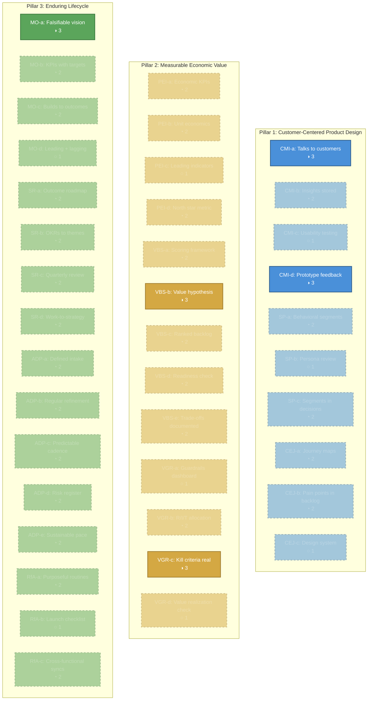
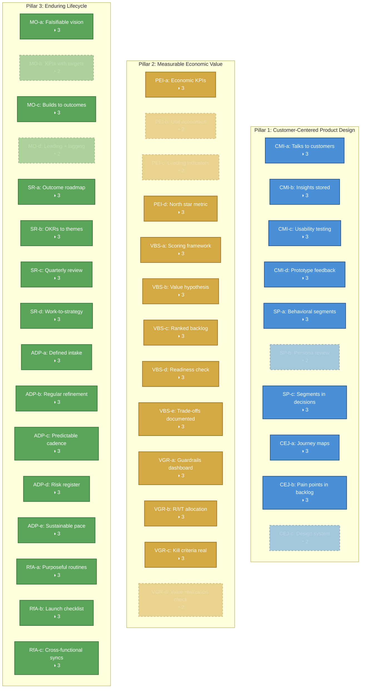
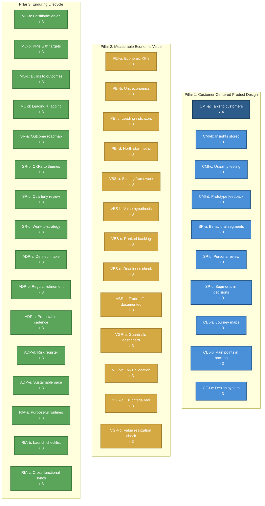
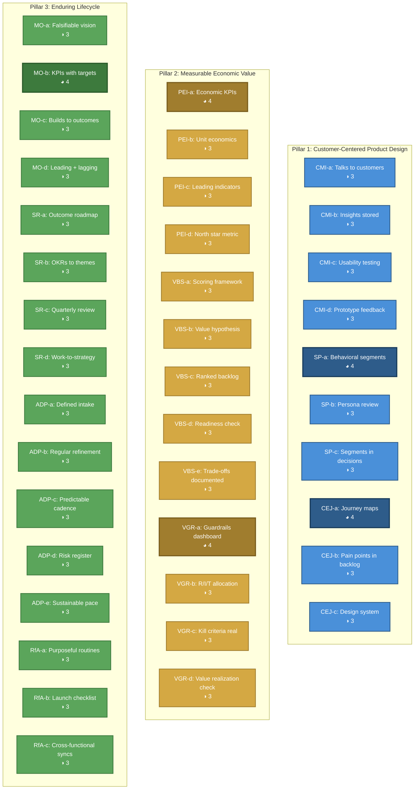
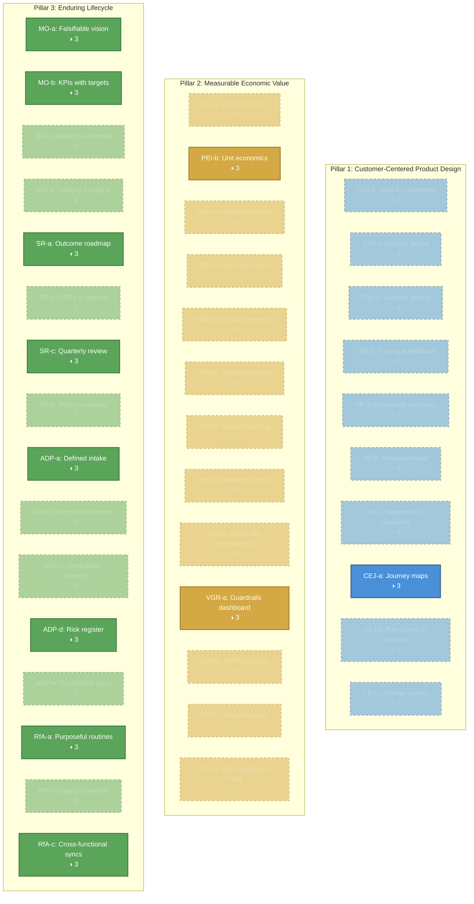

# Product Standards: Applicability — Lifecycle View

Five Mermaid diagrams showing which Level 3 standards are **expected** (target ≥ 3)
vs. **stretch** (target < 3) at each lifecycle stage. Use this to quickly see what
a team at a given stage should have in place.

Companion to `product-standards-applicability.md` (full matrices and lookup table).
Standard inventory from `product-standards-dependencies-reference.md`.

---

## How to Read These Diagrams

- **Solid fill** = Expected at this stage (target maturity ≥ 3)
- **Dashed border** = Stretch at this stage (target maturity < 3, building toward it)
- Standards grouped by pillar: Blue (Pillar 1), Gold (Pillar 2), Green (Pillar 3)
- Target level shown in each node for precision
- Count at the top of each diagram: how many standards are expected vs. stretch

---

## Concept Stage

At Concept, the team is validating assumptions. Discovery and vision are the primary
activities. Most governance and operational standards are stretch — the team is
building toward them but doesn't need them yet.

**Expected: 5 of 39** | **Stretch: 34 of 39**

| Status | Standards |
|--------|-----------|
| Expected (≥3) | CMI-a, CMI-d, VBS-b, VGR-c, MO-a |
| Stretch (<3) | All others |

---

## Launch Stage

At Launch, most standards come online. Discovery continues, delivery cadence
tightens, guardrails protect quality, and launch enablement is critical. The
remaining stretch standards are those that need data accumulation (baselines,
unit economics, leading indicators).

**Expected: 30 of 39** | **Stretch: 9 of 39**

| Status | Standards |
|--------|-----------|
| Stretch (<3) | CMI-b → 3 (just made it), SP-b, CEJ-c, PEI-b, PEI-c, VGR-d, MO-b, MO-d |
| Expected (≥3) | All others |

*Note: 30 standards reach Level 3 at Launch. The 9 stretch standards are those
requiring data accumulation or maturity that comes with time.*

---

## Growth Stage

At Growth, all 39 standards should be at Level 3 or higher. This is the "full
practice" stage — every sub-practice is operational. The team's focus shifts from
establishing practices to broadening and calibrating them.

**Expected: 39 of 39** | **Stretch: 0 of 39**

---

## Maturity Stage

At Maturity, most standards hold at Level 3. Six standards push to Level 4
(optimization): CMI-a (broaden to unmet needs), SP-a (spot emerging segments),
CEJ-a (journey optimization), PEI-a (economic optimization), VGR-a (teams
self-manage guardrails), MO-b (optimize against KPIs).

**Expected: 39 of 39** | **Level 4 targets: 6 of 39**

| Level 4 Standards | Why Advanced at Maturity |
|---|---|
| CMI-a | Focus on unmet needs in underserved segments; multiple signal sources |
| SP-a | Spot emerging segments; retire stale ones |
| CEJ-a | Journey optimization; friction reduction tracking |
| PEI-a | Economic model stable and trusted; optimization |
| VGR-a | Guardrails well-established; teams self-manage |
| MO-b | Optimization against established KPIs; targets recalibrated |

---

## Sunset Stage

At Sunset, scope narrows. Standards split into three categories:
- **Still expected (Level 3):** Transition-critical — journey maps, vision, roadmap,
  risk register, routines, intake, cross-functional coordination
- **Reduced (Level 2):** Less applicable at reduced scope but not irrelevant
- **Contextually elevated:** PEI-b stays at 3 (transition economics need documenting),
  VGR-a stays at 3 (guardrails protect the transition CX)

**Expected: 15 of 39** | **Stretch: 24 of 39**

| Status | Standards |
|--------|-----------|
| Expected (≥3) | CEJ-a, PEI-b, VGR-a, MO-a, MO-b, SR-a, SR-c, ADP-a, ADP-d, RfA-a, RfA-c |
| Stretch (<3) | All others |

---

## Legend

| Visual | Meaning |
|--------|---------|
| Solid fill, thick border | **Expected** — target maturity ≥ 3 at this stage |
| Dashed border, faded fill | **Stretch** — target maturity < 3; building toward it or reduced scope |
| Darker solid fill, thicker border | **Advanced** — target maturity = 4; optimization opportunity |
| Blue nodes | Pillar 1: Customer-Centered Product Design |
| Gold nodes | Pillar 2: Measurable Economic Value |
| Green nodes | Pillar 3: Enduring Lifecycle |

**Standards progression summary:**
- **5 expected at Concept** → **30 at Launch** → **39 at Growth** → **39 at Maturity** → **15 at Sunset**
- The Growth-to-Maturity transition is about depth (6 standards push to Level 4), not breadth
- Sunset narrows to transition-critical standards; lower targets are appropriate, not gaps
