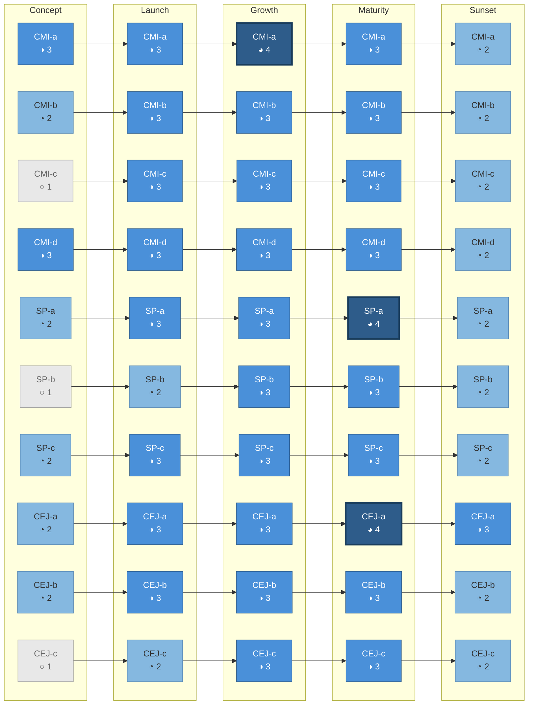
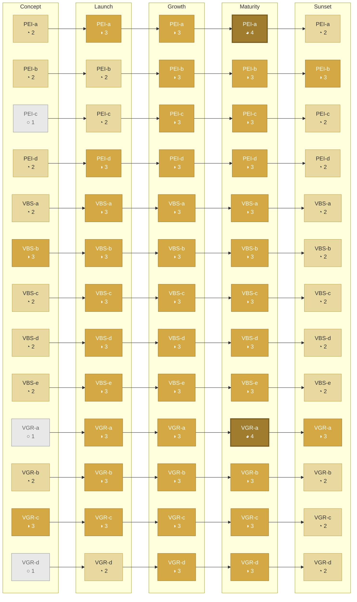
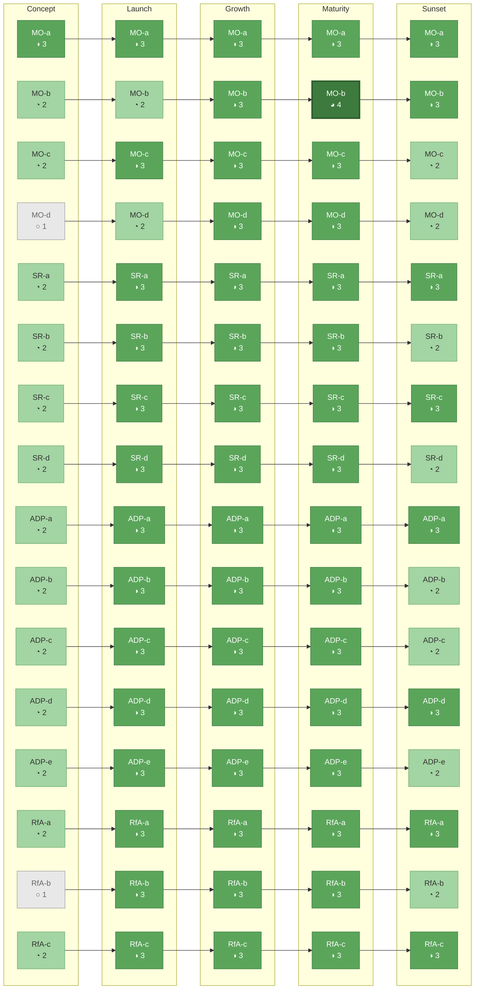

# Product Standards: Applicability — Pillar View

Three Mermaid diagrams showing how target maturity progresses across lifecycle stages
for each pillar's standards. Read left-to-right as the product moves from Concept
through Sunset. Node fill intensity encodes the target level.

Companion to `product-standards-applicability.md` (full matrices and lookup table).
Standard inventory from `product-standards-dependencies-reference.md`.

---

## How to Read These Diagrams

- Each row is one standard flowing left-to-right through 5 lifecycle stages
- **Node fill intensity** encodes target maturity level:
  - Light grey = Level 1 (Emerging)
  - Light fill = Level 2 (Developing)
  - Medium fill = Level 3 (Established)
  - Dark fill = Level 4 (Advanced)
- **Edges** connect the same standard across stages — follow a row to see its arc
- Most standards follow a common arc: light → medium → medium → medium → light
- Standards that peak at Level 4 represent optimization opportunities at Maturity

---

## Pillar 1: Customer-Centered Product Design

10 standards across 3 sub-practices. The arc pattern: discovery-heavy standards
(CMI-a, CMI-d) start high at Concept, governance standards (SP-b, CEJ-c) ramp up
through Growth, and all taper at Sunset except CEJ-a (transition journey mapping
remains critical).

**Peak standards at Maturity:** CMI-a (Level 4 at Growth, broadening signals),
SP-a (Level 4, spotting emerging segments), CEJ-a (Level 4, journey optimization).

| Standard | C | L | G | M | S | Arc Pattern |
|---|:---:|:---:|:---:|:---:|:---:|---|
| CMI-a | 3 | 3 | 4 | 3 | 2 | High start, peaks at Growth |
| CMI-b | 2 | 3 | 3 | 3 | 2 | Standard ramp |
| CMI-c | 1 | 3 | 3 | 3 | 2 | Late start (nothing to test at Concept) |
| CMI-d | 3 | 3 | 3 | 3 | 2 | High start, steady |
| SP-a | 2 | 3 | 3 | 4 | 2 | Peaks at Maturity |
| SP-b | 1 | 2 | 3 | 3 | 2 | Slowest ramp (annual review cadence) |
| SP-c | 2 | 3 | 3 | 3 | 2 | Standard ramp |
| CEJ-a | 2 | 3 | 3 | 4 | 3 | Peaks at Maturity, stays high at Sunset |
| CEJ-b | 2 | 3 | 3 | 3 | 2 | Standard ramp |
| CEJ-c | 1 | 2 | 3 | 3 | 2 | Slowest ramp (design system needs scale) |

---

## Pillar 2: Measurable Economic Value

13 standards across 3 sub-practices. Economic standards lag discovery standards —
you need data before economics are meaningful. VBS-b (value hypothesis) is an
exception: it's core from Concept. VGR standards ramp differently: kill criteria
(VGR-c) start high, guardrails (VGR-a) start low, and benefits realization
(VGR-d) requires a launch before it applies.

**Peak standards at Maturity:** PEI-a (Level 4, economic optimization),
VGR-a (Level 4, teams self-manage guardrails).

| Standard | C | L | G | M | S | Arc Pattern |
|---|:---:|:---:|:---:|:---:|:---:|---|
| PEI-a | 2 | 3 | 3 | 4 | 2 | Peaks at Maturity |
| PEI-b | 2 | 2 | 3 | 3 | 3 | Slow ramp, stays high at Sunset |
| PEI-c | 1 | 2 | 3 | 3 | 2 | Late start (needs baselines) |
| PEI-d | 2 | 3 | 3 | 3 | 2 | Standard ramp |
| VBS-a | 2 | 3 | 3 | 3 | 2 | Standard ramp |
| VBS-b | 3 | 3 | 3 | 3 | 2 | High start, steady |
| VBS-c | 2 | 3 | 3 | 3 | 2 | Standard ramp |
| VBS-d | 2 | 3 | 3 | 3 | 2 | Standard ramp |
| VBS-e | 2 | 3 | 3 | 3 | 2 | Standard ramp |
| VGR-a | 1 | 3 | 3 | 4 | 3 | Late start, peaks at Maturity, stays high |
| VGR-b | 2 | 3 | 3 | 3 | 2 | Standard ramp |
| VGR-c | 3 | 3 | 3 | 3 | 2 | High start (tight kill criteria at Concept) |
| VGR-d | 1 | 2 | 3 | 3 | 2 | Latest start (needs a launch first) |

---

## Pillar 3: Enduring Lifecycle

16 standards across 4 sub-practices. This pillar is the most uniform — at Launch,
nearly all standards hit Level 3 and stay there through Maturity. MO-a (vision)
is the only standard at Level 3 from Concept. At Sunset, the pillar splits:
transition-critical standards (SR-a, SR-c, ADP-a, ADP-d, RfA-a, RfA-c, MO-a,
MO-b) stay at Level 3, while operational cadence standards drop to Level 2.

**Peak standard at Maturity:** MO-b (Level 4, optimization against established KPIs).

| Standard | C | L | G | M | S | Arc Pattern |
|---|:---:|:---:|:---:|:---:|:---:|---|
| MO-a | 3 | 3 | 3 | 3 | 3 | Flat — always critical |
| MO-b | 2 | 2 | 3 | 4 | 3 | Slow ramp, peaks at Maturity |
| MO-c | 2 | 3 | 3 | 3 | 2 | Standard ramp |
| MO-d | 1 | 2 | 3 | 3 | 2 | Late start (needs baselines) |
| SR-a | 2 | 3 | 3 | 3 | 3 | Stays high at Sunset (transition plan) |
| SR-b | 2 | 3 | 3 | 3 | 2 | Standard ramp |
| SR-c | 2 | 3 | 3 | 3 | 3 | Stays high at Sunset |
| SR-d | 2 | 3 | 3 | 3 | 2 | Standard ramp |
| ADP-a | 2 | 3 | 3 | 3 | 3 | Stays high at Sunset (transition intake) |
| ADP-b | 2 | 3 | 3 | 3 | 2 | Standard ramp |
| ADP-c | 2 | 3 | 3 | 3 | 2 | Standard ramp |
| ADP-d | 2 | 3 | 3 | 3 | 3 | Stays high at Sunset (migration risks) |
| ADP-e | 2 | 3 | 3 | 3 | 2 | Standard ramp |
| RfA-a | 2 | 3 | 3 | 3 | 3 | Stays high at Sunset (transition routines) |
| RfA-b | 1 | 3 | 3 | 3 | 2 | Late start, drops at Sunset |
| RfA-c | 2 | 3 | 3 | 3 | 3 | Stays high at Sunset (decommission coordination) |

---

## Legend

| Fill | Level | Harvey Ball | Meaning |
|------|-------|-------------|---------|
| Light grey | 1 — Emerging | ○ | Not yet applicable at this stage |
| Light pillar color | 2 — Developing | ◔ | Building toward; hypothesis or lightweight |
| Medium pillar color | 3 — Established | ◑ | Standard fully in place |
| Dark pillar color | 4 — Advanced | ◕ | Optimizing and extending |

**Pillar color mapping:**
- Pillar 1 (Customer-Centered Product Design): Blue spectrum
- Pillar 2 (Measurable Economic Value): Gold spectrum
- Pillar 3 (Enduring Lifecycle): Green spectrum

**Arc patterns observed:**
| Pattern | Standards | Meaning |
|---------|-----------|---------|
| High start, steady | CMI-a, CMI-d, VBS-b, VGR-c, MO-a | Core from Concept — these define the product |
| Standard ramp | 20+ standards | Level 2 at Concept → Level 3 by Launch → Level 3 through Maturity → Level 2 at Sunset |
| Late start | CMI-c, PEI-c, VGR-d, MO-d, RfA-b | Level 1 at Concept — requires a launch or data accumulation |
| Peaks at Maturity | PEI-a, SP-a, CEJ-a, VGR-a, MO-b | Level 4 at Maturity — optimization opportunity |
| Stays high at Sunset | CEJ-a, PEI-b, VGR-a, MO-a, MO-b, SR-a, SR-c, ADP-a, ADP-d, RfA-a, RfA-c | Transition-critical — don't drop these during sunset |
