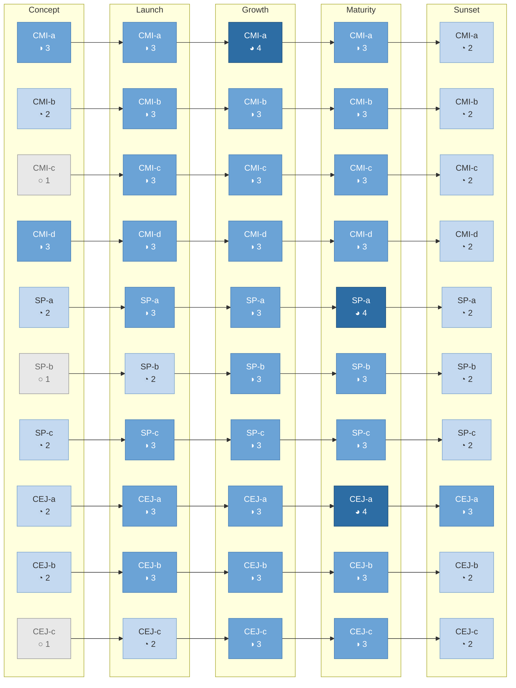
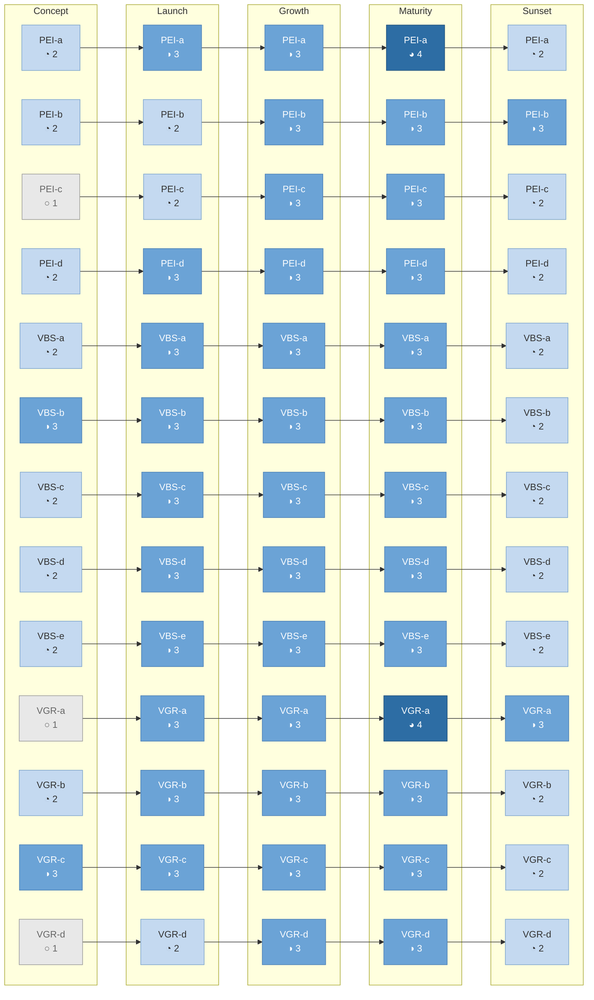
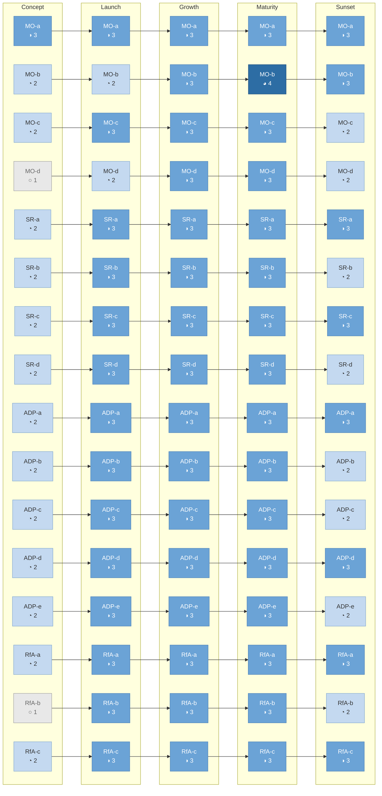

# Product Standards: Applicability Matrix

Target maturity levels for each Level 3 standard, organized by lifecycle stage and
product type. Use this to answer: "Given where my product is today, which standards
should I prioritize?"

Built from the Applicability (Dimension 6) sections of each sub-practice in
`knowledge/product-standards.md`. Standard inventory from
`knowledge/product-standards-dependencies-reference.md`.

**Companion files:**
- `product-standards-applicability-lifecycle.md` — Mermaid diagrams per lifecycle stage (expected vs. stretch)
- `product-standards-applicability-pillar.md` — Mermaid diagrams per pillar (lifecycle progression)

---

## How to Read This Matrix

**Target maturity levels** represent what a well-functioning product team should aim
for at each lifecycle stage. They are guidance, not compliance floors. A team at
Growth stage doesn't fail if one standard is at Level 2 — the matrix tells them
where to focus improvement energy.

**Derivation method:** Each target was derived from the qualitative Applicability
description in `product-standards.md`, cross-validated against:
1. The maturity rubric's observable behaviors at that level
2. The adoption wave sequence from `product-standards-dependencies-adoption.md`
3. Logical consistency (foundation standards reach target before governance standards)

**Level scale:**
| Level | Meaning | Harvey Ball |
|-------|---------|-------------|
| 1 | Emerging — not yet applicable or just starting | ○ |
| 2 | Developing — building toward the practice | ◔ |
| 3 | Established — standard is fully in place | ◑ |
| 4 | Advanced — optimizing and extending | ◕ |
| 5 | Leading — teaching others, evolving the practice | ● |

**Sunset note:** Some standards show a lower target at Sunset. This is intentional —
reduced scope is appropriate, not a gap. The standard shifts focus (e.g., from
"growth metrics" to "transition metrics"), and Level 2-3 reflects that narrower
application.

---

## Find Your Row

Pick your lifecycle stage (row) and product type (column). Cell = your 4-5
highest-priority standards to focus on first.

| | Customer-Facing | Internal Platform | Regulatory |
|---|---|---|---|
| **Concept** | CMI-a, CMI-d, MO-a, VBS-b, PEI-d | CMI-a, MO-a, PEI-d, VBS-b | CMI-a, MO-a, VGR-c, PEI-d |
| **Launch** | CMI-c, VBS-d, ADP-c, RfA-b, VGR-a | ADP-c, RfA-b, VGR-a, CMI-c | VGR-a, RfA-b, ADP-c, CMI-c, VBS-d |
| **Growth** | PEI-a, VBS-a, SR-a, CEJ-a, VGR-b | PEI-a, ADP-a, SR-a, VGR-b | VGR-a, PEI-a, ADP-d, SR-b |
| **Maturity** | VGR-a, SP-a, CEJ-a, MO-b, PEI-a | ADP-d, VGR-a, PEI-a, RfA-a | VGR-a, VGR-c, ADP-d, MO-b |
| **Sunset** | CEJ-a, MO-a, RfA-c, SR-a, ADP-d | ADP-d, RfA-c, SR-a | VGR-a, RfA-c, ADP-d, SR-a |

These are your starting points. For the full target maturity matrix, see the
Standard-Level sections below. For dependency sequencing (what to do first within
a sub-practice), see `product-standards-dependencies-reference.md`.

---

## Sub-Practice Applicability Overview

### Lifecycle Stage Matrix

Qualitative summary of what each sub-practice looks like at each lifecycle stage.
For detailed standard-level targets, see the next section.

| Sub-Practice | Concept | Launch | Growth | Maturity | Sunset |
|---|---|---|---|---|---|
| **CMI** | Heavy discovery — primary activity. Validate problem-solution fit. | Usability testing on MVP. Rapid feedback loops. | Broaden signal sources. Monitor multiple segments. | Focus on unmet needs. Monitor satisfaction decay. | Understand migration needs. Research alternatives. |
| **S&P** | Define initial segments. Personas are hypotheses. | Validate segments against early adopters. | Segments become strategic. Track per-segment metrics. | Look for emerging segments. Retire segments that no longer differ. | Segment-specific migration needs. |
| **CEJ** | Map current journey to find opportunities. Future-state is hypothesis. | Validate journey assumptions with real usage. | Extend to secondary flows. Design system critical. | Journey optimization. Design system governance. | Map the transition journey. Off-ramp experience. |
| **PEI** | Economic model is hypothesis. Viable unit economics story. | Validate early signals. Track trend, not absolutes. | Unit economics improving. Leading indicators calibrated. | Optimization. Model stable and trusted. | Cost of maintenance vs. migration. Transition economics. |
| **VBS** | Sequence by learning value, not delivery value. | Fast feedback. Readiness checks critical. | Full scoring framework. Cost of delay relevant. | Weight risk reduction and tech debt higher. | Sequence migration and decommission tasks. |
| **VGR** | Kill criteria tight. R/I/T mostly Transform. | Kill on adoption signals. Guardrails protect quality. | Guardrails widen. R/I/T balances. Benefits realization routine. | R/I/T to Run/Improve. Guardrails well-established. | Guardrails protect transition CX. R/I/T almost all Run. |
| **MO** | Vision is primary artifact. KPIs hypothesized. | KPIs live, baselines establishing. | Full KPI suite with targets. Vision validated. | Optimization against KPIs. Vision may need refreshing. | KPIs shift to transition metrics. Vision = sunset rationale. |
| **S&R** | Roadmap mostly Later/Vision. OKRs = validation milestones. | Shifts to Now/Next. OKRs = adoption signals. | All horizons active. Balance growth with sustainability. | Weighted to Now/Next. Optimization/retention. | Transition plan. Migration/decommission milestones. |
| **ADP** | Lightweight intake. Short cycles (1-2 weeks). | Tight cadence (weekly). Aggressive intake filter. | Standard cadence (2-week/monthly). Intake feeds scoring. | Broader cadence. Lower, predictable intake. | Migration/decommission cadence. Restricted intake. |
| **RfA** | Fewer routines — discovery syncs, stakeholder alignment. | Full cadence. Launch enablement critical. | Routine calendar stabilizes. Tiers established. | Well-established, may need pruning. | Transition-focused: migration, communication, decommission. |

### Product Type Matrix

| Sub-Practice | Customer-Facing | Internal Platform | Regulatory |
|---|---|---|---|
| **CMI** | Full discovery: interviews, usability, analytics, support signals. | Internal users are still customers. Shadow sessions, support channel monitoring. | Compliance stakeholders as signal source. Regulatory change monitoring. |
| **S&P** | Full segmentation. Behavioral data and research drive segments. | Segment by workflow or role, not org chart. | Include regulated-entity segments alongside end-user segments. |
| **CEJ** | Full journey mapping. Design system directly impacts trust. | Employee journeys. Map workflow including system handoffs. | Include compliance touchpoints (disclosures, consent, verification). |
| **PEI** | Revenue, retention, cost-to-acquire. | Productivity gain, error reduction, process time saved. | Risk avoidance, compliance cost, cost of non-compliance. |
| **VBS** | Value scoring weights customer impact. Market timing affects sequencing. | Value = productivity/reliability. Include downstream team impact. | Compliance deadlines create hard constraints. Score discretionary capacity. |
| **VGR** | CX guardrails critical — direct trust/retention impact. | Reliability guardrails — downstream teams depend on uptime. | Compliance itself is a guardrail. Non-compliance = kill trigger. |
| **MO** | Adoption, satisfaction, retention, revenue. | Platform reliability, developer productivity, downstream satisfaction. | Compliance coverage, audit readiness, time-to-compliance. |
| **S&R** | Roadmap communicates to sales, marketing, customer success. | Roadmap serves consuming teams. | Compliance deadlines create fixed roadmap items. |
| **ADP** | Cadence aligns to market timing. Risk includes competitive/market. | Cadence aligns to consuming team needs. Risk includes downstream impact. | Compliance deadlines create hard delivery constraints. Regulatory risk explicit. |
| **RfA** | Launch includes customer comms, sales enablement, marketing. | Launch focuses on consuming team readiness. | Launch must include compliance sign-off. Regulatory change monitoring routine. |

---

## Standard-Level Target Maturity by Lifecycle Stage

Target level (1-5) for each Level 3 standard at each lifecycle stage. Standards
grouped by pillar and sub-practice. Standard codes match
`product-standards-dependencies-reference.md`.

### Pillar 1: Customer-Centered Product Design

#### 1. Customer & Market Insights (CMI)

| Standard | Concept | Launch | Growth | Maturity | Sunset |
|---|:---:|:---:|:---:|:---:|:---:|
| **CMI-a:** Team talks to customers regularly (2-3/month) | 3 | 3 | 4 | 3 | 2 |
| **CMI-b:** Insights stored where team can find them | 2 | 3 | 3 | 3 | 2 |
| **CMI-c:** Usability testing before launch | 1 | 3 | 3 | 3 | 2 |
| **CMI-d:** Prototypes get user feedback before building | 3 | 3 | 3 | 3 | 2 |

**Rationale:** CMI-a and CMI-d are high at Concept because discovery is the primary
activity. CMI-c is low at Concept (nothing to launch-test yet). All drop at Sunset
as scope narrows to migration research.

#### 2. Segmentation & Personas (S&P)

| Standard | Concept | Launch | Growth | Maturity | Sunset |
|---|:---:|:---:|:---:|:---:|:---:|
| **SP-a:** Segments based on needs/behavior, not demographics | 2 | 3 | 3 | 4 | 2 |
| **SP-b:** Personas reviewed at least yearly | 1 | 2 | 3 | 3 | 2 |
| **SP-c:** Team references segments when making feature decisions | 2 | 3 | 3 | 3 | 2 |

**Rationale:** At Concept, segments are hypotheses (Level 2). By Launch they're
validated against real adopters. SP-a reaches Level 4 at Maturity (looking for
emerging segments, retiring stale ones). SP-b starts at Level 1 because you're
creating personas, not reviewing them.

#### 3. Customer & Employee Journeys (CEJ)

| Standard | Concept | Launch | Growth | Maturity | Sunset |
|---|:---:|:---:|:---:|:---:|:---:|
| **CEJ-a:** Journey maps exist and get updated | 2 | 3 | 3 | 4 | 3 |
| **CEJ-b:** Pain points in backlog with journey context | 2 | 3 | 3 | 3 | 2 |
| **CEJ-c:** Design system in place and used | 1 | 2 | 3 | 3 | 2 |

**Rationale:** CEJ-a reaches Level 4 at Maturity (journey optimization). CEJ-a stays
at Level 3 during Sunset because mapping the transition journey is critical. CEJ-c
lags — not meaningful until Growth when multiple teams build on the design system.

### Pillar 2: Measurable Economic Value

#### 4. Product Economic Insights (PEI)

| Standard | Concept | Launch | Growth | Maturity | Sunset |
|---|:---:|:---:|:---:|:---:|:---:|
| **PEI-a:** Team knows key economic KPIs, reviews monthly | 2 | 3 | 3 | 4 | 2 |
| **PEI-b:** Unit economics documented | 2 | 2 | 3 | 3 | 3 |
| **PEI-c:** Leading indicators alongside lagging | 1 | 2 | 3 | 3 | 2 |
| **PEI-d:** North star metric stated and explained | 2 | 3 | 3 | 3 | 2 |

**Rationale:** PEI-b stays at Level 2 during Launch — unit economics are "ugly but
tracked." PEI-b reaches Level 3 at Sunset because transition economics (cost of
maintenance vs. migration) need documentation. PEI-a reaches Level 4 at Maturity
(optimization against established model).

#### 5. Value-Based Sequencing (VBS)

| Standard | Concept | Launch | Growth | Maturity | Sunset |
|---|:---:|:---:|:---:|:---:|:---:|
| **VBS-a:** Scores on value, risk, effort before sequencing | 2 | 3 | 3 | 3 | 2 |
| **VBS-b:** Each item has a value hypothesis | 3 | 3 | 3 | 3 | 2 |
| **VBS-c:** Backlog ranked, no ties | 2 | 3 | 3 | 3 | 2 |
| **VBS-d:** Readiness check before committing | 2 | 3 | 3 | 3 | 2 |
| **VBS-e:** Trade-offs documented when deprioritized | 2 | 3 | 3 | 3 | 2 |

**Rationale:** VBS-b is Level 3 at Concept — value hypotheses are the core activity
when sequencing assumptions to test. The rest start at Level 2 because the scoring
framework and ranking discipline formalize during Launch.

#### 6. Value Guardrails & Realization (VGR)

| Standard | Concept | Launch | Growth | Maturity | Sunset |
|---|:---:|:---:|:---:|:---:|:---:|
| **VGR-a:** Guardrails for CX, reliability, capacity on dashboard | 1 | 3 | 3 | 4 | 3 |
| **VGR-b:** R/I/T allocation targets set and reviewed quarterly | 2 | 3 | 3 | 3 | 2 |
| **VGR-c:** Kill criteria real — at least one initiative stopped | 3 | 3 | 3 | 3 | 2 |
| **VGR-d:** Post-launch value hypothesis check | 1 | 2 | 3 | 3 | 2 |

**Rationale:** VGR-a is Level 1 at Concept (no product to guard yet), Level 4 at
Maturity (well-established, teams self-manage). VGR-c is Level 3 from Concept —
tight kill criteria with short time horizons are essential for concept-stage
products. VGR-d can't apply at Concept (nothing launched yet).

### Pillar 3: Enduring Lifecycle

#### 7. Measurable Outcomes (MO)

| Standard | Concept | Launch | Growth | Maturity | Sunset |
|---|:---:|:---:|:---:|:---:|:---:|
| **MO-a:** Vision is falsifiable, specific to customers | 3 | 3 | 3 | 3 | 3 |
| **MO-b:** KPIs have targets, reviewed monthly | 2 | 2 | 3 | 4 | 3 |
| **MO-c:** Planning connects builds to expected outcomes | 2 | 3 | 3 | 3 | 2 |
| **MO-d:** Leading and lagging indicators tracked | 1 | 2 | 3 | 3 | 2 |

**Rationale:** MO-a is Level 3 across all stages — vision is the primary artifact
at Concept and becomes the sunset rationale. MO-b reaches Level 4 at Maturity
(optimization against established KPIs) and stays at 3 during Sunset (transition
metrics need targets too). MO-d lags because you can't track indicators before
you have baselines.

#### 8. Strategy & Roadmap (S&R)

| Standard | Concept | Launch | Growth | Maturity | Sunset |
|---|:---:|:---:|:---:|:---:|:---:|
| **SR-a:** Roadmap Now/Next/Later with outcomes | 2 | 3 | 3 | 3 | 3 |
| **SR-b:** OKRs align to strategic themes | 2 | 3 | 3 | 3 | 2 |
| **SR-c:** Roadmap reviewed and updated quarterly | 2 | 3 | 3 | 3 | 3 |
| **SR-d:** Team explains work-to-strategy connection | 2 | 3 | 3 | 3 | 2 |

**Rationale:** SR-a and SR-c stay at Level 3 during Sunset because the transition
plan IS the roadmap and it needs regular review. SR-b and SR-d drop to Level 2
at Sunset because strategic alignment simplifies (the strategy is "sunset").

#### 9. Adaptive Delivery Plans (ADP)

| Standard | Concept | Launch | Growth | Maturity | Sunset |
|---|:---:|:---:|:---:|:---:|:---:|
| **ADP-a:** Defined intake with evaluation criteria | 2 | 3 | 3 | 3 | 3 |
| **ADP-b:** Backlog refined regularly | 2 | 3 | 3 | 3 | 2 |
| **ADP-c:** Delivery in waves/sprints, predictable cadence | 2 | 3 | 3 | 3 | 2 |
| **ADP-d:** Risk register reviewed at checkpoints | 2 | 3 | 3 | 3 | 3 |
| **ADP-e:** Team monitors sustainable pace | 2 | 3 | 3 | 3 | 2 |

**Rationale:** ADP-a stays at Level 3 during Sunset (intake restricted to transition
work — still needs criteria). ADP-d stays at Level 3 during Sunset (data migration
and user communication risks are real). ADP-b, ADP-c, and ADP-e drop to Level 2
as scope and pace simplify.

#### 10. Routines for Activation (RfA)

| Standard | Concept | Launch | Growth | Maturity | Sunset |
|---|:---:|:---:|:---:|:---:|:---:|
| **RfA-a:** Regular routines with clear purpose | 2 | 3 | 3 | 3 | 3 |
| **RfA-b:** Launch checklist with cross-functional engagement | 1 | 3 | 3 | 3 | 2 |
| **RfA-c:** Cross-functional syncs at key milestones | 2 | 3 | 3 | 3 | 3 |

**Rationale:** RfA-a and RfA-c stay at Level 3 during Sunset because transition
routines and decommission coordination are critical. RfA-b drops to Level 2
(launch checklist shifts to a transition checklist — similar idea, narrower scope).

---

## Standard-Level Product Type Adjustments

Adjustments apply only where the product type materially changes the emphasis or
target. Blank cells = default target applies as-is.

### Pillar 1: Customer-Centered Product Design

| Standard | Customer-Facing | Internal Platform | Regulatory |
|---|---|---|---|
| **CMI-a** | Full interviews + analytics + support signals | Shadow sessions + support channel monitoring replace formal interviews | Add regulatory change monitoring as a signal source |
| **CMI-b** | — | Shared within the team is sufficient; cross-team sharing less critical | Include regulatory interpretation notes alongside user insights |
| **CMI-c** | — | Usability = workflow efficiency testing | Include compliance flow testing (disclosures, consent) |
| **CMI-d** | — | Prototypes may be wireframes or API contracts | Prototypes must include compliance touchpoints |
| **SP-a** | Behavioral data drives segments | Segment by workflow/role, not org chart | Add regulated-entity segments alongside user segments |
| **SP-b** | — | — | Review when regulations change, not just yearly |
| **SP-c** | — | — | Compliance needs may define a segment on their own |
| **CEJ-a** | — | Employee journeys; include system handoffs | Include compliance touchpoints (disclosures, consent, verification) |
| **CEJ-b** | — | Pain points may be workflow friction, not UX friction | Include compliance pain points |
| **CEJ-c** | Consistency directly impacts trust | Design system scope may be narrower | — |

### Pillar 2: Measurable Economic Value

| Standard | Customer-Facing | Internal Platform | Regulatory |
|---|---|---|---|
| **PEI-a** | Revenue, retention, cost-to-acquire | Productivity gain, error reduction, process time saved | Risk avoidance + compliance cost |
| **PEI-b** | Standard unit economics | Translate productivity to economic terms | Model cost of non-compliance |
| **PEI-c** | — | — | Leading = compliance readiness signals |
| **PEI-d** | Revenue or retention-based | Productivity or reliability-based | Compliance coverage or risk reduction-based |
| **VBS-a** | Weight customer impact heavily | Include downstream team impact | Compliance deadlines override discretionary scoring |
| **VBS-b** | — | — | — |
| **VBS-c** | Market timing may affect sequence | — | Hard compliance deadlines sit outside the ranked backlog |
| **VBS-d** | — | — | Regulatory readiness is a readiness dimension |
| **VBS-e** | — | — | Compliance items can't be traded off; document discretionary trade-offs only |
| **VGR-a** | CX guardrails = trust/retention | Reliability guardrails = upstream dependency | Compliance itself is a guardrail; non-compliance = kill trigger |
| **VGR-b** | — | — | R/I/T may be constrained by compliance-mandated Run |
| **VGR-c** | — | — | Non-compliance triggers are pre-defined kill criteria |
| **VGR-d** | Revenue/market share validation | Productivity/error reduction validation | Risk avoidance + cost of compliance validation |

### Pillar 3: Enduring Lifecycle

| Standard | Customer-Facing | Internal Platform | Regulatory |
|---|---|---|---|
| **MO-a** | Adoption, satisfaction, revenue outcomes | Reliability, developer experience, downstream satisfaction | Compliance coverage, audit readiness |
| **MO-b** | Market metrics (retention, NPS) | Platform health metrics | Compliance metrics (coverage, readiness) |
| **MO-c** | — | — | Include regulatory outcomes alongside product outcomes |
| **MO-d** | — | — | Leading = regulatory readiness; lagging = audit results |
| **SR-a** | Communicates to sales, marketing, CS | Serves consuming teams | Fixed compliance items alongside discretionary roadmap |
| **SR-b** | Market-oriented OKRs | Platform reliability/experience OKRs | Include regulatory readiness OKRs |
| **SR-c** | — | — | — |
| **SR-d** | — | — | Include compliance strategy alongside product strategy |
| **ADP-a** | — | Cadence aligns to consuming team needs | — |
| **ADP-b** | — | — | — |
| **ADP-c** | Align to market timing | Align to consuming team release cadence | Compliance deadlines = hard delivery constraints |
| **ADP-d** | Include competitive/market risks | Include downstream impact assessment | Must include regulatory risk explicitly |
| **ADP-e** | — | — | — |
| **RfA-a** | — | — | Include regulatory change monitoring routine |
| **RfA-b** | Include customer comms, sales enablement, marketing | Focus on consuming team readiness | Must include compliance sign-off |
| **RfA-c** | — | — | — |

---

## Applicability Heatmap

Three Mermaid diagrams showing target maturity per standard across lifecycle stages.
Node fill intensity encodes target level. Read left-to-right as the product
progresses through its lifecycle.

### Pillar 1: Customer-Centered Product Design

### Pillar 2: Measurable Economic Value

### Pillar 3: Enduring Lifecycle

---

## Legend

| Symbol | Target Level | Meaning |
|--------|-------------|---------|
| ○ | 1 — Emerging | Not yet applicable or just starting at this stage |
| ◔ | 2 — Developing | Building toward the practice; hypothesis or lightweight |
| ◑ | 3 — Established | Standard fully in place for this lifecycle stage |
| ◕ | 4 — Advanced | Optimizing and extending the practice |
| ● | 5 — Leading | Teaching others, evolving the practice |

**Fill intensity in Mermaid diagrams:**

| Fill | Level | Visual |
|------|-------|--------|
| Light grey | 1 | Lowest intensity — not yet applicable |
| Light blue | 2 | Developing — building toward |
| Medium blue | 3 | Established — target for most standards at most stages |
| Dark blue | 4 | Advanced — optimization stage |
| Very dark blue | 5 | Leading — not a typical target per lifecycle stage |

**Reading the heatmap:** Each row is one standard flowing left-to-right through
lifecycle stages. Darker nodes = higher target maturity. Most standards follow an
arc: light at Concept, medium (Level 3) through Growth/Maturity, then lighter at
Sunset. Standards that peak at Level 4 are marked as optimization opportunities
at Maturity.
