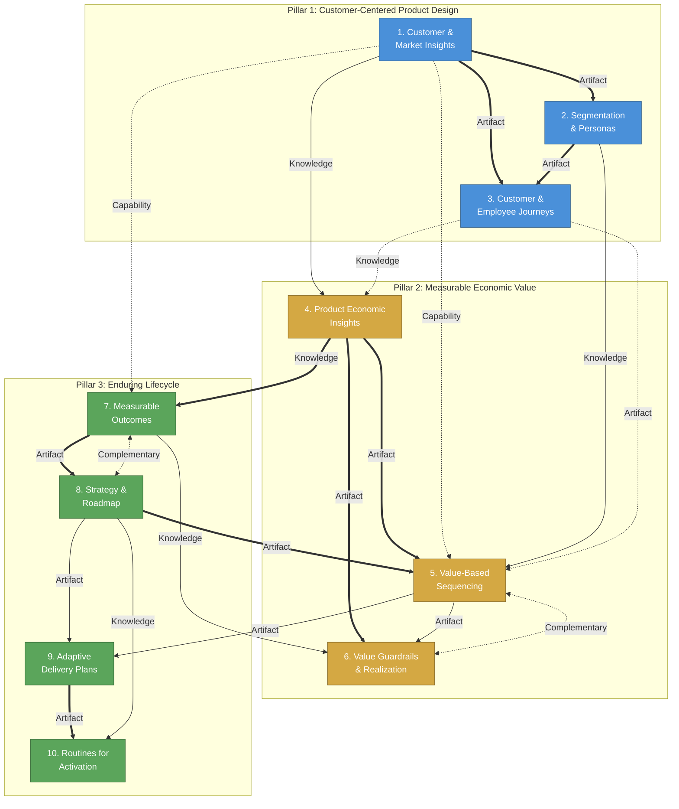

# Product Standards: Dependency Map — Adoption View

How the 10 sub-practices depend on each other. Use this map to decide where teams
should start, what to sequence next, and what breaks if you skip a prerequisite.

Built using `frameworks/dependency-mapping/FRAMEWORK.md`.

---

## How to Read This Map

- **Arrows** show direction: source → target means "do the source before the target"
- **Line style** shows dependency type:
  - Solid = Knowledge (understanding required)
  - Dashed = Artifact (output feeds in)
  - Dotted = Capability (organizational muscle needed)
- **Line weight** shows strength:
  - Thick/bold = Strong (skipping creates dependency debt)
  - Normal = Moderate (less effective without, but functional)
  - Thin = Light (nice-to-have ordering)
- **Double arrows** (↔) = Complementary (mutual reinforcement, no strict order)

---

## Sub-Practice Relationship Table

| # | Source | Target | Type | Strength | Rationale |
|---|--------|--------|------|----------|-----------|
| 1 | CMI | S&P | Artifact | Strong | Segments require customer evidence. Without research insights, segments are based on org charts or guesses — not behaviors or needs. CMI produces the interview data and behavioral evidence that S&P turns into segments. |
| 2 | CMI | CEJ | Artifact | Strong | Journey maps require observed user behavior. Without discovery conversations and usability data, journey maps are internal assumptions drawn on a whiteboard. CMI provides the evidence base for accurate journey mapping. |
| 3 | CMI | PEI | Knowledge | Moderate | Understanding what customers value informs which economic KPIs matter. Without customer insight, economic models optimize for internal metrics that may not correlate with customer value. |
| 4 | CMI | VBS | Capability | Moderate | Teams that talk to customers regularly can write credible value hypotheses. Without a discovery muscle, value hypotheses are wishes, not testable claims. |
| 5 | S&P | CEJ | Artifact | Strong | Journey maps are mapped per segment. Without defined segments, you get one generic journey that doesn't reflect how different user groups experience the product differently. Persona artifacts feed directly into journey context. |
| 6 | S&P | VBS | Knowledge | Moderate | Knowing which segments benefit from a feature informs sequencing decisions. Without segments, "who is this for?" has no answer, and prioritization lacks a customer lens. |
| 7 | CEJ | VBS | Artifact | Light | Journey pain points feed the backlog that VBS sequences. Useful but not required — teams can sequence without journey context. |
| 8 | PEI | VBS | Artifact | Strong | Value-based sequencing requires economic inputs. Without unit economics, north star metric, and KPI baselines, scoring items on "value" is subjective. PEI provides the economic model that makes D/F/V scoring grounded. |
| 9 | PEI | VG&R | Artifact | Strong | Guardrails require metrics to guard. Without an economic model and defined KPIs, R/I/T allocation has no economic basis, and kill criteria have no trigger data. PEI's outputs are VG&R's inputs. |
| 10 | PEI | MO | Knowledge | Strong | Measurable outcomes require an economic vocabulary. Without understanding unit economics and what to measure, vision statements can't be falsifiable and KPI targets are arbitrary. |
| 11 | VBS | VG&R | Artifact | Moderate | Kill criteria and value realization checks reference the value hypotheses and sequencing rationale from VBS. Without VBS's scoring, VG&R has nothing to calibrate against post-launch. |
| 12 | VBS | ADP | Artifact | Moderate | Delivery plans consume the prioritized, ranked backlog that VBS produces. Without ranked work, delivery cadence exists but the team is pulling items in arbitrary order. |
| 13 | MO | S&R | Artifact | Strong | Strategy and roadmap need measurable outcomes to anchor on. Without a falsifiable vision and KPI targets, roadmaps become feature lists and OKRs lack measurable key results. MO provides the "what we're trying to achieve" that S&R translates into "how we'll get there." |
| 14 | MO | VG&R | Knowledge | Moderate | Guardrails protect outcomes. Without defined outcomes, guardrails have nothing to protect — they become arbitrary thresholds. |
| 15 | S&R | VBS | Artifact | Strong | Sequencing needs strategic context. Without strategic themes and a roadmap, prioritization optimizes locally — each item scored in isolation without "does this advance the strategy?" as a lens. |
| 16 | S&R | ADP | Artifact | Moderate | Delivery plans execute the roadmap. Without a roadmap, the team has a cadence but no strategic direction — they're predictably delivering the wrong things. |
| 17 | S&R | RfA | Knowledge | Moderate | Routines need strategic context to have purpose. Without strategy, routines exist but lack the "why are we reviewing this?" framing. Roadmap reviews and stakeholder updates require a roadmap to review. |
| 18 | ADP | RfA | Artifact | Strong | Routines operationalize the delivery cadence. Without a defined delivery model (intake, cadence, risk register), routines are meetings without machinery. ADP provides the rhythms that RfA activates. |
| 19 | MO ↔ S&R | | Complementary | Strong | Outcomes and strategy reinforce each other bidirectionally. Better outcomes sharpen strategy; clearer strategy produces more coherent outcomes. Neither is purely prerequisite — but MO has a slight edge as the starting point (you need to know what you're optimizing before you can set direction). |
| 20 | VBS ↔ VG&R | | Complementary | Moderate | Sequencing and guardrails reinforce each other. Better sequencing makes guardrails meaningful (you're protecting something worth protecting); guardrails feed back into sequencing (kill criteria change what gets prioritized next). |
| 21 | CMI | MO | Capability | Light | Teams with a discovery practice are better at defining falsifiable outcomes because they ground vision in observed reality. But MO can function without CMI — the outcomes just risk being disconnected from users. |
| 22 | CEJ | PEI | Knowledge | Light | Journey maps reveal where value leaks — drop-offs, workarounds, manual steps. This informs economic modeling. Useful but not required. |
| 23 | RfA | ADP | Capability | Light | Well-run routines improve delivery predictability over time. Retros surface process issues; refinement improves estimation. This is the reverse direction of #18 — the Complementary aspect of the ADP↔RfA pair. |

---

## Adoption View Diagram

---

## Legend

| Visual | Meaning |
|--------|---------|
| `==>` thick arrow | Strong dependency (skipping creates dependency debt) |
| `-->` normal arrow | Moderate dependency (less effective without) |
| `-.->` thin/dotted arrow | Light dependency (nice-to-have) |
| `<-.->` double dotted | Complementary (mutual reinforcement) |
| Blue nodes | Pillar 1: Customer-Centered Product Design |
| Gold nodes | Pillar 2: Measurable Economic Value |
| Green nodes | Pillar 3: Enduring Lifecycle |

---

## Recommended Adoption Sequence

### Wave 1: Foundations — Know Your Customer, Know Your Numbers

**Sub-practices:** Customer & Market Insights (1), Product Economic Insights (4), Measurable Outcomes (7)

**Why first:** These three are the foundation nodes — heavy outgoing dependencies, few incoming ones. CMI feeds the entire customer understanding chain. PEI feeds the entire economic value chain. MO anchors strategy and guardrails.

**What it enables:** Teams can define who they serve (CMI), what economic value looks like (PEI), and what outcomes they're driving toward (MO). Without these three, everything downstream is built on assumptions.

**Dependency debt risk if skipped:** Segments without customer evidence are demographics, not segments. Prioritization without economics is opinion-based. Strategy without measurable outcomes is a feature list.

### Wave 2: Structure — Organize What You Know

**Sub-practices:** Segmentation & Personas (2), Strategy & Roadmap (8)

**Why second:** Both consume Wave 1 outputs directly. S&P turns CMI evidence into actionable segments. S&R translates MO into strategic direction. These provide the structural scaffolding that Waves 3-4 operate within.

**What it enables:** Teams can answer "who is this for?" (S&P) and "where are we going?" (S&R). Feature decisions and roadmaps now have both a customer lens and a strategic frame.

**Dependency debt risk if skipped:** Journey maps without segments are generic. Prioritization without strategy optimizes locally. Delivery without direction is predictable but aimless.

### Wave 3: Action — Prioritize and Map

**Sub-practices:** Customer & Employee Journeys (3), Value-Based Sequencing (5)

**Why third:** CEJ needs both CMI evidence and S&P segments. VBS needs PEI economics, S&R strategic context, and benefits from S&P's customer lens. These are the "translate understanding into action" practices.

**What it enables:** Teams can trace the customer experience end-to-end (CEJ) and make grounded sequencing decisions with value hypotheses, D/F/V scoring, and ranked backlogs (VBS).

**Dependency debt risk if skipped:** Backlogs without value-based sequencing are opinion-ranked. Journey maps without segments and research are internal assumptions.

### Wave 4: Governance and Rhythm — Sustain the System

**Sub-practices:** Value Guardrails & Realization (6), Adaptive Delivery Plans (9), Routines for Activation (10)

**Why last:** These operationalize everything above. VG&R guards the economics (needs PEI + VBS). ADP creates the delivery engine (needs VBS + S&R). RfA activates the cadence (needs ADP + S&R). Without the preceding waves, these practices exist as process without substance.

**What it enables:** Teams have guardrails that protect real value, a delivery system that executes strategically, and routines that sustain the whole system. This is the "self-governing" state.

**Dependency debt risk if skipped:** Guardrails without economics are arbitrary thresholds. Delivery cadence without prioritization is busy work. Routines without strategic context are meetings no one values.

---

## Cross-Pillar Dependencies Summary

The strongest cross-pillar connections:

1. **Pillar 1 → Pillar 2:** CMI feeds PEI (knowing customers informs economics) and VBS (discovery capability enables value hypotheses)
2. **Pillar 2 → Pillar 3:** PEI feeds MO (economic vocabulary enables measurable outcomes)
3. **Pillar 3 → Pillar 2:** S&R feeds VBS (strategic context enables grounded sequencing) — this is the critical cross-pillar feedback loop
4. **Pillar 1 → Pillar 3:** CMI capability supports MO (discovery-practiced teams write better outcomes)

The pillars are not independent silos. Pillar 1 (understand customers) feeds Pillar 2 (create economic value) which feeds Pillar 3 (sustain over time), with Pillar 3's strategy feeding back into Pillar 2's sequencing. This is the system loop that makes adoption sequencing important — you can't cherry-pick one pillar without the others.
