# Product Standards: Dependency Map — Reference View

Cross-sub-practice dependencies at the individual Level 3 (Established) standard
level. Use this map when coaching teams on specific gaps — if a standard is weak,
trace which other standards are affected or which prerequisites are missing.

Built using `frameworks/dependency-mapping/FRAMEWORK.md`.
Companion to `product-standards-dependencies-adoption.md` (sub-practice level).

---

## How to Read This Map

- **Nodes** are individual Level 3 standards, grouped by sub-practice and pillar
- **Arrows** show cross-sub-practice dependencies only (within-sub-practice dependencies are implied by the rubric)
- **Line style** shows dependency type: solid = Knowledge, dashed = Artifact, dotted = Capability
- **Edge labels** are abbreviated — full rationale in the relationship table below
- This diagram is intentionally dense. It's a reference tool, not a presentation slide.

---

## Level 3 Standards Inventory

### Pillar 1: Customer-Centered Product Design

**1. Customer & Market Insights (CMI)**
- CMI-a: Team talks to customers on a regular schedule (2-3 interviews/month)
- CMI-b: Insights are stored somewhere the team can find them
- CMI-c: Usability testing happens before launch
- CMI-d: Prototypes get user feedback before the team commits to building

**2. Segmentation & Personas (S&P)**
- SP-a: Segments are based on what customers need or how they behave, not just who they are
- SP-b: Personas get reviewed at least yearly
- SP-c: Team references specific segments when making feature decisions

**3. Customer & Employee Journeys (CEJ)**
- CEJ-a: Journey maps exist for key flows and get updated when things change
- CEJ-b: Known pain points are in the backlog with journey context
- CEJ-c: A design system is in place and teams actually use it

### Pillar 2: Measurable Economic Value

**4. Product Economic Insights (PEI)**
- PEI-a: Team knows the key economic KPIs and reviews them monthly
- PEI-b: Unit economics are documented (cost to serve, value per transaction)
- PEI-c: Leading indicators sit alongside lagging ones
- PEI-d: Team can state the north star metric and explain why it matters

**5. Value-Based Sequencing (VBS)**
- VBS-a: Team scores items on value, risk, and effort before sequencing
- VBS-b: Each item has a short value hypothesis
- VBS-c: Backlog is ranked — no ties
- VBS-d: Before committing, team checks readiness (people, dependencies, WIP)
- VBS-e: Trade-offs are documented when items are deprioritized

**6. Value Guardrails & Realization (VG&R)**
- VGR-a: Guardrails for CX, reliability, and capacity are defined and on a dashboard
- VGR-b: R/I/T allocation targets are set and reviewed quarterly
- VGR-c: Kill criteria are real — at least one initiative has been stopped
- VGR-d: Post-launch, team checks whether the value hypothesis played out

### Pillar 3: Enduring Lifecycle

**7. Measurable Outcomes (MO)**
- MO-a: Vision says what value the product delivers to specific customers and you could check whether it's true
- MO-b: KPIs have targets and get reviewed monthly
- MO-c: Planning connects what the team builds to what they expect to achieve
- MO-d: Both leading and lagging indicators are tracked

**8. Strategy & Roadmap (S&R)**
- SR-a: Roadmap organized by time horizons (Now/Next/Later) with outcomes, not just features
- SR-b: OKRs align to strategic themes with measurable key results
- SR-c: Roadmap reviewed and updated quarterly
- SR-d: Team can explain how their work connects to strategy

**9. Adaptive Delivery Plans (ADP)**
- ADP-a: Defined intake process with evaluation criteria for new work
- ADP-b: Backlog gets refined regularly
- ADP-c: Delivery runs in waves or sprints with a predictable cadence
- ADP-d: Risk register exists and gets reviewed at checkpoints
- ADP-e: Team monitors whether pace is sustainable

**10. Routines for Activation (RfA)**
- RfA-a: Regular routines with clear purpose: refinement, roadmap review, stakeholder updates, retros
- RfA-b: Launch has a checklist — support, training, ops, and compliance are engaged before go-live
- RfA-c: Cross-functional syncs happen at key milestones

---

## Cross-Sub-Practice Standard Relationships

| # | Source | Target | Type | Strength | Rationale |
|---|--------|--------|------|----------|-----------|
| 1 | CMI-a | SP-a | Artifact | Strong | Regular customer conversations produce the behavioral evidence that makes needs-based segmentation possible. Without interview data, segments default to demographics. |
| 2 | CMI-b | SP-b | Artifact | Moderate | Stored insights are what gets reviewed during annual persona updates. Without a research repository, persona reviews are memory-based. |
| 3 | CMI-a | CEJ-a | Artifact | Strong | Journey maps require observed behavior from real user conversations. Without regular customer contact, journey maps are internal assumptions. |
| 4 | CMI-b | CEJ-b | Artifact | Moderate | Stored insights feed backlog items with journey context. Research repository provides the evidence base for tagging pain points to journey stages. |
| 5 | CMI-c | VGR-d | Capability | Moderate | Teams that do usability testing before launch are equipped to do post-launch value checks. The testing muscle transfers to realization tracking. |
| 6 | CMI-d | VBS-b | Capability | Moderate | Teams that get prototype feedback before building have the discovery muscle to write credible value hypotheses. Without prototype testing practice, hypotheses are untested claims. |
| 7 | SP-a | CEJ-a | Artifact | Strong | Journey maps are mapped per segment. Without behavior-based segments, you get one generic journey. Segment definitions scope and differentiate journey maps. |
| 8 | SP-c | VBS-a | Knowledge | Moderate | Referencing segments in feature decisions means the team has a customer lens for scoring value. "Who benefits?" is answerable because segments exist. |
| 9 | SP-c | SR-a | Knowledge | Moderate | Referencing segments in decisions means the roadmap can specify which segments each outcome targets. Without segments, roadmap outcomes are generic. |
| 10 | CEJ-b | VBS-c | Artifact | Light | Pain points with journey context feed the backlog that VBS ranks. Journey-tagged items carry richer context for sequencing decisions. |
| 11 | CEJ-a | PEI-b | Knowledge | Light | Journey maps reveal where value leaks occur (drop-offs, workarounds), which informs unit economics. Journey friction points often map to cost-to-serve drivers. |
| 12 | PEI-a | VBS-a | Artifact | Strong | Monthly KPI review provides the value baseline that D/F/V scoring references. Without known KPIs, "value" in scoring is subjective. |
| 13 | PEI-b | VBS-a | Artifact | Strong | Unit economics provide the cost and value data that makes effort/value scoring grounded. Without cost-to-serve, "effort" is guesswork. |
| 14 | PEI-d | VBS-b | Artifact | Strong | The north star metric anchors value hypotheses. "We believe X will move [north star]" requires knowing the north star. |
| 15 | PEI-c | MO-d | Artifact | Strong | Leading indicators defined at the economic level feed directly into the outcome measurement framework. PEI establishes which indicators exist; MO ensures they have targets and get tracked. |
| 16 | PEI-d | MO-a | Knowledge | Strong | The north star metric is the foundation of a falsifiable vision. Without it, vision statements can't be checked against reality. |
| 17 | PEI-a | VGR-a | Artifact | Strong | Economic KPIs are what guardrail dashboards display. Without defined KPIs, guardrails have nothing to guard. |
| 18 | PEI-b | VGR-b | Knowledge | Moderate | Unit economics inform R/I/T allocation — understanding cost-to-serve helps determine how much to invest in Run vs. Improve vs. Transform. |
| 19 | VBS-b | VGR-d | Artifact | Moderate | Post-launch value checks compare actual results against the value hypothesis from VBS. Without a hypothesis, there's nothing to check against. |
| 20 | VBS-a | VGR-c | Knowledge | Moderate | Kill criteria reference the scoring dimensions from prioritization. "This initiative is below threshold on value" requires a scoring model. |
| 21 | VBS-e | VGR-c | Artifact | Light | Documented trade-offs from deprioritization provide evidence for kill decisions. "We already deprioritized items X and Y for the same reason" supports stopping Z. |
| 22 | VBS-c | ADP-b | Artifact | Moderate | A ranked backlog feeds refinement. Without ranking, refinement has no priority order to work from — the team refines whatever's top of mind. |
| 23 | VBS-d | ADP-a | Knowledge | Moderate | Readiness checks (people, dependencies, WIP) are the same lens that intake evaluation uses. Teams practicing readiness checks at commitment time apply the same thinking at intake. |
| 24 | MO-a | SR-a | Artifact | Strong | A falsifiable vision provides the outcomes that the roadmap organizes around. Without measurable outcomes, the roadmap defaults to features. |
| 25 | MO-b | SR-b | Artifact | Strong | KPI targets become the measurable key results in OKRs. Without defined targets, key results are vague or unmeasurable. |
| 26 | MO-c | SR-d | Knowledge | Moderate | When planning connects builds to outcomes, the team can explain their strategy connection — because the connection is explicit in their planning docs. |
| 27 | MO-d | VGR-a | Artifact | Moderate | Leading and lagging indicators feed the guardrail dashboard. MO defines what to track; VGR puts thresholds on it. |
| 28 | SR-a | VBS-a | Artifact | Strong | Strategic themes from the roadmap provide the "strategic alignment" dimension for D/F/V scoring. Without strategic context, scoring optimizes locally. |
| 29 | SR-b | VBS-b | Knowledge | Moderate | OKRs provide the frame for value hypotheses. "We believe X will contribute to [OKR]" grounds the hypothesis in strategy. |
| 30 | SR-c | VGR-b | Knowledge | Moderate | Quarterly roadmap reviews are the natural checkpoint for R/I/T allocation review. Without roadmap cadence, R/I/T review has no anchor event. |
| 31 | SR-a | ADP-a | Knowledge | Moderate | Roadmap outcomes inform intake evaluation criteria. "Does this align with our Now/Next/Later?" is an intake question that requires a roadmap. |
| 32 | SR-c | RfA-a | Artifact | Moderate | Quarterly roadmap review is itself a routine — and provides the content for stakeholder update routines. Without roadmap cadence, review routines lack substance. |
| 33 | SR-d | RfA-c | Knowledge | Light | Teams that can explain strategy connection are better at scoping cross-functional syncs — they know which milestones matter and why other teams should care. |
| 34 | ADP-b | RfA-a | Artifact | Strong | Refinement is a routine. ADP defines what refinement does (backlog grooming); RfA ensures it has a cadence, owner, and purpose statement. |
| 35 | ADP-c | RfA-a | Artifact | Strong | Wave/sprint cadence is the delivery rhythm that routines operationalize. ADP defines the cadence; RfA ensures the supporting routines (standups, demos, retros) exist. |
| 36 | ADP-d | RfA-a | Artifact | Moderate | Risk register review at checkpoints is a routine. ADP defines the register; RfA ensures review happens at wave boundaries. |
| 37 | ADP-a | RfA-b | Knowledge | Moderate | Intake evaluation criteria inform the launch checklist — the same "is this ready?" thinking applied to "is this ready to ship?" |
| 38 | ADP-c | RfA-c | Artifact | Moderate | Predictable delivery cadence makes cross-functional milestone syncs possible. Without predictable waves, other teams can't plan around your milestones. |

---

## Reference View Diagram

```mermaid
graph TD
    %% Styling
    classDef cmi fill:#4A90D9,color:#fff,stroke:#2E5C8A,font-size:11px
    classDef sp fill:#5B9BD5,color:#fff,stroke:#3A6E9A,font-size:11px
    classDef cej fill:#6CAED8,color:#fff,stroke:#4A7FA0,font-size:11px
    classDef pei fill:#D4A843,color:#fff,stroke:#8A6E2A,font-size:11px
    classDef vbs fill:#C9963B,color:#fff,stroke:#7A5E20,font-size:11px
    classDef vgr fill:#BE8433,color:#fff,stroke:#6A4E16,font-size:11px
    classDef mo fill:#5BA55B,color:#fff,stroke:#3A6E3A,font-size:11px
    classDef sr fill:#4E944E,color:#fff,stroke:#2E6E2E,font-size:11px
    classDef adp fill:#418341,color:#fff,stroke:#226222,font-size:11px
    classDef rfa fill:#347234,color:#fff,stroke:#165616,font-size:11px

    subgraph P1["Pillar 1: Customer-Centered Product Design"]
        subgraph CMI_group["1. Customer & Market Insights"]
            CMI_a["CMI-a<br/>Regular customer<br/>conversations"]
            CMI_b["CMI-b<br/>Stored &<br/>findable insights"]
            CMI_c["CMI-c<br/>Usability testing<br/>before launch"]
            CMI_d["CMI-d<br/>Prototype feedback<br/>before building"]
        end
        subgraph SP_group["2. Segmentation & Personas"]
            SP_a["SP-a<br/>Behavior/needs-<br/>based segments"]
            SP_b["SP-b<br/>Personas reviewed<br/>yearly"]
            SP_c["SP-c<br/>Segments referenced<br/>in decisions"]
        end
        subgraph CEJ_group["3. Customer & Employee Journeys"]
            CEJ_a["CEJ-a<br/>Journey maps<br/>for key flows"]
            CEJ_b["CEJ-b<br/>Pain points in<br/>backlog w/ context"]
            CEJ_c["CEJ-c<br/>Design system<br/>in use"]
        end
    end

    subgraph P2["Pillar 2: Measurable Economic Value"]
        subgraph PEI_group["4. Product Economic Insights"]
            PEI_a["PEI-a<br/>Key KPIs<br/>reviewed monthly"]
            PEI_b["PEI-b<br/>Unit economics<br/>documented"]
            PEI_c["PEI-c<br/>Leading + lagging<br/>indicators"]
            PEI_d["PEI-d<br/>North star metric<br/>stated"]
        end
        subgraph VBS_group["5. Value-Based Sequencing"]
            VBS_a["VBS-a<br/>Score on value/<br/>risk/effort"]
            VBS_b["VBS-b<br/>Value hypothesis<br/>per item"]
            VBS_c["VBS-c<br/>Ranked backlog<br/>no ties"]
            VBS_d["VBS-d<br/>Readiness check<br/>before commit"]
            VBS_e["VBS-e<br/>Trade-offs<br/>documented"]
        end
        subgraph VGR_group["6. Value Guardrails & Realization"]
            VGR_a["VGR-a<br/>Guardrails on<br/>dashboard"]
            VGR_b["VGR-b<br/>R/I/T reviewed<br/>quarterly"]
            VGR_c["VGR-c<br/>Kill criteria<br/>enforced"]
            VGR_d["VGR-d<br/>Post-launch<br/>value check"]
        end
    end

    subgraph P3["Pillar 3: Enduring Lifecycle"]
        subgraph MO_group["7. Measurable Outcomes"]
            MO_a["MO-a<br/>Falsifiable<br/>vision"]
            MO_b["MO-b<br/>KPIs w/ targets<br/>reviewed monthly"]
            MO_c["MO-c<br/>Builds connected<br/>to outcomes"]
            MO_d["MO-d<br/>Leading + lagging<br/>tracked"]
        end
        subgraph SR_group["8. Strategy & Roadmap"]
            SR_a["SR-a<br/>Now/Next/Later<br/>outcome roadmap"]
            SR_b["SR-b<br/>OKRs aligned<br/>to themes"]
            SR_c["SR-c<br/>Quarterly<br/>roadmap review"]
            SR_d["SR-d<br/>Team explains<br/>strategy link"]
        end
        subgraph ADP_group["9. Adaptive Delivery Plans"]
            ADP_a["ADP-a<br/>Intake w/<br/>eval criteria"]
            ADP_b["ADP-b<br/>Regular<br/>refinement"]
            ADP_c["ADP-c<br/>Wave/sprint<br/>cadence"]
            ADP_d["ADP-d<br/>Risk register<br/>at checkpoints"]
            ADP_e["ADP-e<br/>Sustainable<br/>pace monitoring"]
        end
        subgraph RfA_group["10. Routines for Activation"]
            RfA_a["RfA-a<br/>Purposeful<br/>routines"]
            RfA_b["RfA-b<br/>Launch<br/>checklist"]
            RfA_c["RfA-c<br/>Cross-functional<br/>milestone syncs"]
        end
    end

    %% === CROSS-SUB-PRACTICE DEPENDENCIES ===

    %% CMI → S&P (Strong Artifact, Moderate Artifact)
    CMI_a ==>|"evidence"| SP_a
    CMI_b -->|"repository"| SP_b

    %% CMI → CEJ (Strong Artifact, Moderate Artifact)
    CMI_a ==>|"behavior"| CEJ_a
    CMI_b -->|"evidence"| CEJ_b

    %% CMI → VBS (Moderate Capability)
    CMI_d -.->|"discovery muscle"| VBS_b

    %% CMI → VGR (Moderate Capability)
    CMI_c -.->|"testing muscle"| VGR_d

    %% S&P → CEJ (Strong Artifact)
    SP_a ==>|"segments"| CEJ_a

    %% S&P → VBS (Moderate Knowledge)
    SP_c -->|"customer lens"| VBS_a

    %% S&P → S&R (Moderate Knowledge)
    SP_c -->|"segment targets"| SR_a

    %% CEJ → VBS (Light Artifact)
    CEJ_b -.->|"pain points"| VBS_c

    %% CEJ → PEI (Light Knowledge)
    CEJ_a -.->|"value leaks"| PEI_b

    %% PEI → VBS (Strong Artifact x3)
    PEI_a ==>|"KPI baseline"| VBS_a
    PEI_b ==>|"unit econ"| VBS_a
    PEI_d ==>|"north star"| VBS_b

    %% PEI → MO (Strong Knowledge, Strong Artifact)
    PEI_d ==>|"north star"| MO_a
    PEI_c ==>|"indicators"| MO_d

    %% PEI → VGR (Strong Artifact, Moderate Knowledge)
    PEI_a ==>|"KPIs"| VGR_a
    PEI_b -->|"cost basis"| VGR_b

    %% VBS → VGR (Moderate Artifact x2, Light Artifact)
    VBS_b -->|"hypothesis"| VGR_d
    VBS_a -->|"scoring model"| VGR_c
    VBS_e -.->|"trade-off evidence"| VGR_c

    %% VBS → ADP (Moderate Artifact, Moderate Knowledge)
    VBS_c -->|"ranked items"| ADP_b
    VBS_d -->|"readiness lens"| ADP_a

    %% MO → S&R (Strong Artifact x2, Moderate Knowledge)
    MO_a ==>|"vision"| SR_a
    MO_b ==>|"targets"| SR_b
    MO_c -->|"outcome link"| SR_d

    %% MO → VGR (Moderate Artifact)
    MO_d -->|"indicators"| VGR_a

    %% S&R → VBS (Strong Artifact, Moderate Knowledge)
    SR_a ==>|"strategic context"| VBS_a
    SR_b -->|"OKR frame"| VBS_b

    %% S&R → ADP (Moderate Knowledge)
    SR_a -->|"roadmap context"| ADP_a

    %% S&R → VGR (Moderate Knowledge)
    SR_c -->|"review cadence"| VGR_b

    %% S&R → RfA (Moderate Artifact, Light Knowledge)
    SR_c -->|"review content"| RfA_a
    SR_d -.->|"strategic scope"| RfA_c

    %% ADP → RfA (Strong Artifact x2, Moderate Artifact, Moderate Knowledge, Moderate Artifact)
    ADP_b ==>|"refinement"| RfA_a
    ADP_c ==>|"cadence"| RfA_a
    ADP_d -->|"risk review"| RfA_a
    ADP_a -->|"readiness lens"| RfA_b
    ADP_c -->|"predictability"| RfA_c

    %% Apply classes
    class CMI_a,CMI_b,CMI_c,CMI_d cmi
    class SP_a,SP_b,SP_c sp
    class CEJ_a,CEJ_b,CEJ_c cej
    class PEI_a,PEI_b,PEI_c,PEI_d pei
    class VBS_a,VBS_b,VBS_c,VBS_d,VBS_e vbs
    class VGR_a,VGR_b,VGR_c,VGR_d vgr
    class MO_a,MO_b,MO_c,MO_d mo
    class SR_a,SR_b,SR_c,SR_d sr
    class ADP_a,ADP_b,ADP_c,ADP_d,ADP_e adp
    class RfA_a,RfA_b,RfA_c rfa
```

---

## Legend

| Visual | Meaning |
|--------|---------|
| `==>` thick arrow | Strong dependency |
| `-->` normal arrow | Moderate dependency |
| `-.->` thin/dotted arrow | Light dependency |
| Edge labels | Short description of what flows |
| Blue shades | Pillar 1: Customer-Centered Product Design |
| Gold shades | Pillar 2: Measurable Economic Value |
| Green shades | Pillar 3: Enduring Lifecycle |

---

## Coaching Guide: Using the Reference View

### When a standard is weak

1. Find the node in the diagram
2. Trace incoming arrows — which prerequisites are missing?
3. Trace outgoing arrows — which downstream standards will suffer?
4. Focus coaching on the strongest incoming dependency first

### Common patterns

**"We do journey maps but they're generic"**
→ Trace CEJ-a. Incoming strong dependencies from CMI-a (customer conversations) and SP-a (behavior-based segments). Fix segments first, then ground journey maps in research.

**"We prioritize but it feels subjective"**
→ Trace VBS-a. Incoming strong dependencies from PEI-a (KPI baseline), PEI-b (unit economics), and SR-a (strategic context). The scoring model needs economic and strategic inputs to be grounded.

**"Our routines feel pointless"**
→ Trace RfA-a. Incoming strong dependencies from ADP-b (refinement) and ADP-c (cadence). Routines need delivery machinery to operationalize. Also trace the moderate dependency from SR-c — routines need strategic content to review.

**"We set guardrails but nobody follows them"**
→ Trace VGR-a. Incoming strong dependency from PEI-a (KPIs). Moderate from MO-d (leading/lagging indicators). Guardrails need real metrics, not aspirational thresholds. Also check VGR-c — kill criteria require the scoring model from VBS-a to have teeth.

**"Our roadmap is just a feature list"**
→ Trace SR-a. Incoming strong dependency from MO-a (falsifiable vision). The roadmap needs measurable outcomes to organize around. If the vision isn't falsifiable, the roadmap can't have outcomes.

### Isolated standards

CEJ-c (design system in use) has no strong cross-sub-practice dependencies. It supports journey consistency and UI quality but operates independently of the dependency chain. Teams can adopt it at any wave without prerequisite concerns.

ADP-e (sustainable pace monitoring) has no strong incoming cross-sub-practice dependencies. It's internally driven — the team monitors its own capacity regardless of other practices.
